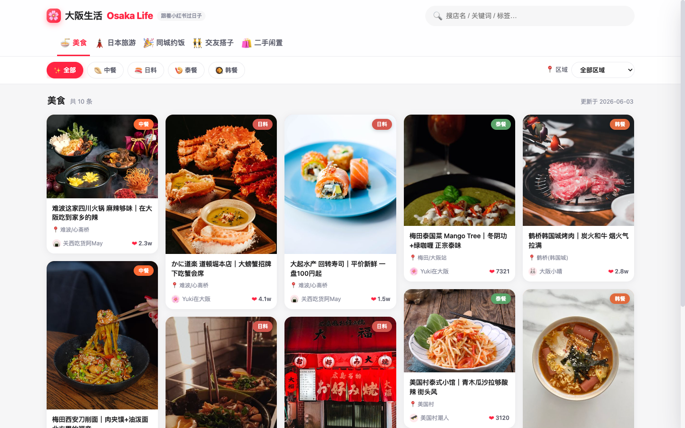

# 🌸 大阪生活 · Osaka Life

对标**小红书**风格的大阪生活指南，全中文。把美食、旅游、同城、交友、二手都收进一个站，
点笔记看详情，有地址的就内嵌 **Google 地图**定位。

> 静态网页，**零构建**。`index.html` 直接双击就能打开看。



---

## 📦 模块

| 模块 | 说明 |
|------|------|
| 🍜 **美食** | 下分 **中餐 / 日料 / 泰餐 / 韩餐**，支持**区域搜索** |
| 🗼 **日本旅游** | 大阪景点 + 关西周边 |
| 🎉 **同城约饭** | 约饭 / 聚会 / 线下活动 |
| 👯 **交友搭子** | 找朋友 / 饭搭 / 旅游搭 / 语言搭 |
| 🛍️ **二手闲置** | 转让 / 求购 / 免费送 |

每个模块都能按**区域**（难波、梅田、鹤桥…）筛选，顶部还有全局搜索。

---

## 🚀 打开方式

**最简单**：直接双击 `index.html`，浏览器就能用（数据从 `data.js` 读，无需服务器）。

> 嵌入的 Google 地图是公开 iframe，**不需要任何 API Key**。
> 若某些浏览器对 `file://` 下的地图有限制，用本地服务器打开更稳：
> ```bash
> python3 -m http.server 8000   # 然后访问 http://localhost:8000
> ```

---

## ✏️ 改内容：编辑 `data.js`

所有内容都在 `data.js` 的 `items` 数组里，**它本质就是一个 JSON 对象**
（外面套了 `window.OSAKA_DATA =` 只是为了能双击直接打开）。照着复制一条就能加：

```js
{
  id: 115,                       // 唯一编号，别重复
  module: "food",                // food | travel | events | social | market
  category: "japanese",          // 仅美食用：chinese | japanese | thai | korean
  area: "难波/心斋桥",            // 区域（区域搜索用），见 data.js 顶部 areas
  emoji: "🍣",                   // 占位封面用的 emoji
  title: "标题",
  author: { name: "昵称", avatar: "🌸" },
  likes: "1.2w", collects: "8000", comments: "300",
  tags: ["寿司", "平价"],
  desc: "正文描述……",
  address: "大阪市…",            // 填了才会显示 Google 地图；社交/二手可不填
  price: "¥¥", hours: "11:00–22:00",   // 可选
  date: "本周六 18:30", contact: "私信",  // 同城/交友/二手可选
}
```

- **加模块 / 区域 / 美食分类**：改 `data.js` 顶部的 `modules` / `areas` / `foodCategories`。
- **换真实照片（已内置，无需改代码）**：给 item 加
  `cover: "images/xxx.jpg"`（单张封面）或 `images: ["images/a.jpg","images/b.jpg"]`（多张，详情页显示可点图廊）即可。
  把图片放进 `images/` 目录，或直接用 https 链接。不填则用 emoji 占位。

#### 一键自动配图（Pexels 免费图库）
`scripts/fetch-images.mjs` 会给【还没有 cover】的条目各拉一张同类美食/景点的真实图填进去：
```bash
PEXELS_API_KEY=你的key node scripts/fetch-images.mjs
# 或把 key 写进 scripts/pexels.key（已在 .gitignore，不会提交），然后直接：
node scripts/fetch-images.mjs
```
- 已有 `cover` 的（含你放的实拍）会**跳过、不覆盖**。想换某条：删掉它那行 `cover` 再跑一次。
- 新条目可加 `imgQuery: "english search term"` 控制搜索词。
- ⚠️ Pexels 是**同类通用图**，不是那家店的实拍；要精准就放自己的图。
- 免费 key 申请（不用信用卡）：https://www.pexels.com/api/

### ⚠️ 关于图片来源（重要）
**别直接搬运小红书上的图**：那些图归原作者版权（小红书 ToS 也禁止转载），而且小红书 CDN 有**防盗链**，外链到本站多半会 403 裂图。请用：
- 你**自己拍的 / 自己在小红书发布的**照片（你拥有版权）✅
- 免费可商用图库 **Unsplash / Pexels** ✅
- 商家**官方授权**图 ✅

---

## ⏰ 每天 7:00 / 19:00 定时更新（已搭好壳子）

定时任务的**框架和调度都已就绪**，缺的是「数据源」那一环——原因见下方诚实说明。

### 先说实话：小红书爬取
小红书有**强反爬**（登录墙 + 接口签名 `x-s`/`x-t` + 设备风控），**没有官方公开 API**。
一个无人值守、每天稳定跑的爬虫**无法保证可靠**，而且涉及其服务条款风险。
所以我没有硬塞一个会随时失效的爬虫，而是给你留好**可插拔的接口**：

- 抓取逻辑在 `scripts/update-content.mjs` 的 `fetchFromXiaohongshu()`，**默认占位、不改你的数据**。
- 把它替换成你自己评估可行/合规的数据源（手动整理 / 登录 Cookie / RSS 中转等），脚本即会自动合并去重并更新 `data.js`。

### 手动跑一次
```bash
node scripts/update-content.mjs            # 正常运行（无新内容则不动文件）
node scripts/update-content.mjs --dry-run  # 只看不写
```

### 装成每天 7:00 / 19:00 自动跑（macOS launchd）
```bash
cp scripts/com.osakalife.update.plist ~/Library/LaunchAgents/
launchctl load ~/Library/LaunchAgents/com.osakalife.update.plist
launchctl start com.osakalife.update      # 立即测试一次
```
停用：`launchctl unload ~/Library/LaunchAgents/com.osakalife.update.plist`。
日志在 `scripts/update.log`。**本机需保持开机/未睡眠**才会触发。

> 用 cron 也行：`crontab -e` 加一行
> `0 7,19 * * * cd /Users/samuel/Documents/osaka-life && /usr/bin/env node scripts/update-content.mjs >> scripts/update.log 2>&1`

---

## 🗂️ 文件结构

```
osaka-life/
├─ index.html      页面骨架
├─ styles.css      样式（小红书风瀑布流 + 详情抽屉）
├─ app.js          交互逻辑（模块/分类/区域筛选、搜索、详情、地图嵌入）
├─ data.js         ★ 所有内容（你主要编辑这里）
├─ scripts/
│  ├─ update-content.mjs        定时更新脚本（数据源待接入）
│  └─ com.osakalife.update.plist  launchd 定时任务模板（7:00 / 19:00）
└─ docs/preview.png
```

---

## ⚠️ 说明（诚实声明）

- 站内内容为**示例/整理**，仅供参考；地址、营业时间等请以商家/地图实际为准。
- **封面图为 emoji 占位**，不是真实照片，请按上文替换为你的实拍或授权图片。
- 本项目模仿的是小红书的**浏览体验/排版**，**不抓取、不使用**小红书的任何实际内容或图片。
- 地图用 Google Maps 的公开嵌入 iframe，仅做**位置展示**，无自定义图层/路线。
